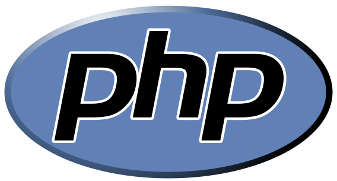
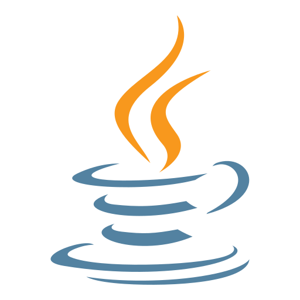
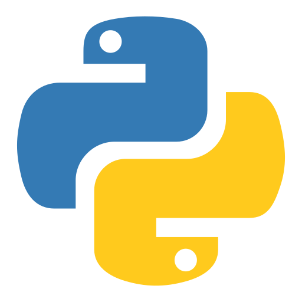
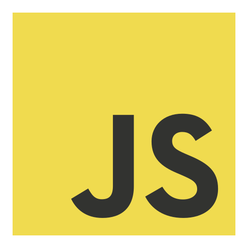
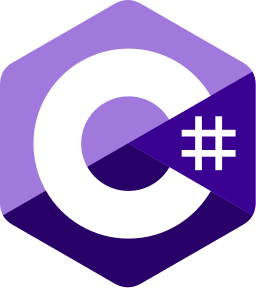

<h1 align="center">👋 Hello, I´m Miguel! </h1>

  💻 Software Developer

---

### 👨‍💼 About Me

- 🔭 Currently working at **DrawlineIT**
- 🌱 Deepening my knowledge in **DevOps**, **Operating Systems Fundamentals**, and **Image Processing & Computer Vision**.
- 💡 I'm interested in **software engineering, back-end development, and artificial intelligence**

---

### 📫 Reach Me

  
  &nbsp;
  

---

### 🛠️ Languages / Tools / IDEs

#### 💻 Languages

  
  
  
  
  
  
  
  
  
  

#### ⚙️ Tools

  <!-- Git -->
  

  <!-- Docker -->
  

  <!-- Postman -->
  

  <!-- REST APIs -->
  

  <!-- Cron / Linux -->
  

  <!-- Android Studio -->
  

#### 🧑‍💻 IDEs

  <!-- VS Code -->
  

  <!-- IntelliJ IDEA -->
  

  <!-- PyCharm -->
  

  <!-- PhpStorm -->
  

  <!-- Eclipse -->
  

  <!-- Jupyter Notebook -->
  

  <!-- Anaconda -->
  

---

### 📊 GitHub Statistics

  
  

---

### ❤️ A little bit more about me...

> “Between lines of code and waves of the sea, I find my balance.”  
> — *Miguel Cordeiro*

  

---
